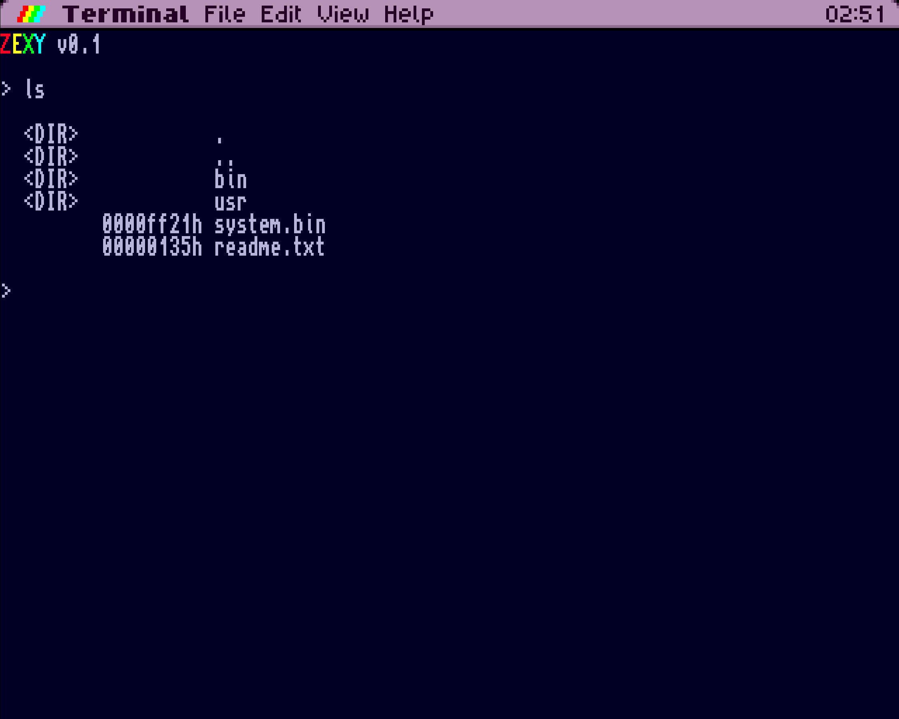

# Zexy

*Zexy* is an experimental project which aims to deliver a modern looking operating system for ZX Spectrum Next.



## Calling convention

* Unless specified differently, `af`, `bc`, `de` and `hl` are not callee-preserved
* Register `ix` is usually used to pass structure pointers
* Register `iy` is usually used for callbacks
* Dynamic dispatch is implemented using `ix/iy` register pair, where `ix` points to object and `iy` points to procedure (functional interface) or vtable of procedures (interface).

## Running

Run any executable in `nex` directory by its name, like:

```
./run console
```

## Cleaning

```
./clean
```
